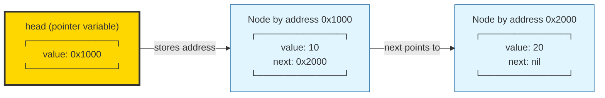

# Singly Linked List

Data structure of a Singly Linked List

Node is a struct that holds a value and pointer to the next node, address in memory only for example purposes for illustration current address of Node and next node's address in memory.

Without a `tail` pointer.

We can get the address of a node using `&node`.

```go
type Node struct {
    data int
    next *Node
}
```

The `head` field stores a pointer to the first node in the list.

```go
type LinkedList struct {
    head  *Node
    lenth int
}
```


